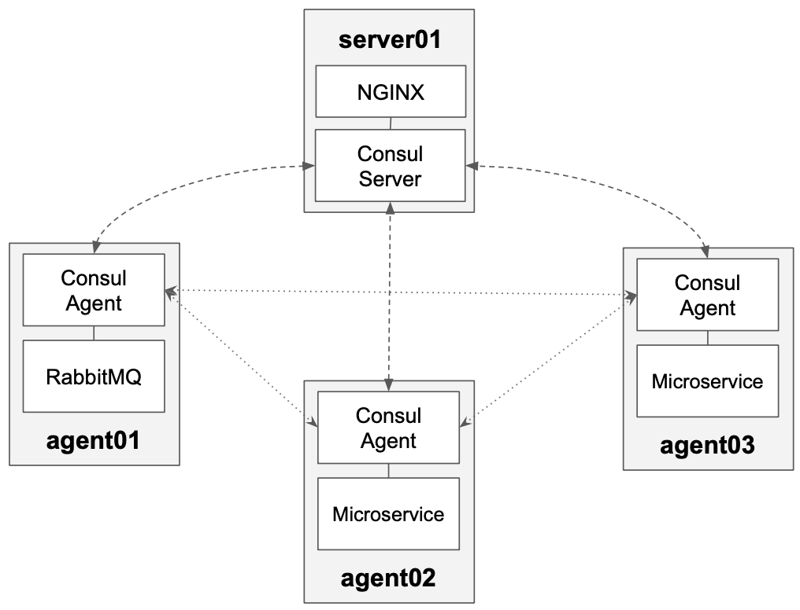
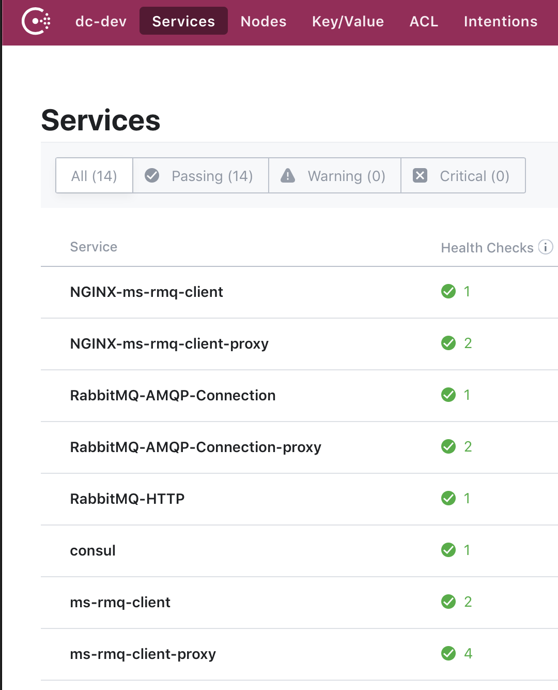
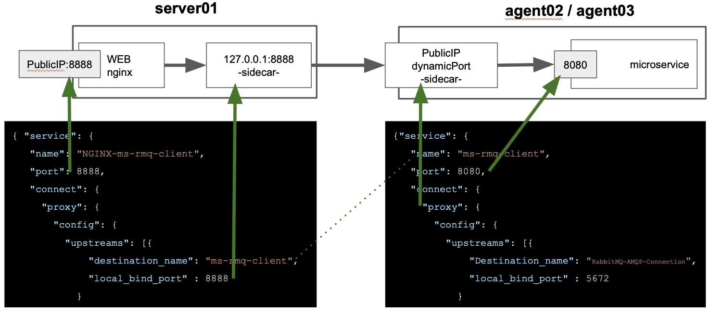

# Introduction
This is a POC to implement Service Mesh pattern in standalone machines or VMs with Consul Connect.

It will be done between RabbitMQ and a RabbitMQ Microservice client servers.

This POC use vagrant to provision one Consul server with three servers (consul agents) in the host machine as per below image.

NGINX is a proxy server that can be used to implement Service Mesh as well, but in this case I'm going to use it only to give access to Consul DNS and Consul web console, because by defaul Consul publish this services in the loopback interface.



**Consul services**
This POC register following set services.



**Undestanding Consul Configuration**

Below image show a couple of "Consul service configuration files" and how match with ports in each node. 



## GUI
- Consul http://172.20.20.10:8500/ui/dc-dev/nodes
- RabbitMQ http://172.20.20.11:15672/#/queues
- RabbitMQ-Client microservice (**Service Mesh**) http://172.20.20.10:8888/swagger-ui.html

## Utility commands
**Read the logs from a microservice:**
```
ms-box:~$ sudo tail -f /var/log/rabbitmq-client.log
```
**List TCP ports open:**
```
any-box:~$ netstat -tunpl | grep -i listen
```
**List Announcement ports** (RabbitMQ connections tab)
```
any-box:~$ netstat -ano
```
**Checking DNS server**
```
any-box$ dig @172.20.20.10 -p 8600 ms-rmq-client.service.consul SRV
```

## Vagrant operations

- Starting servers: vagrant up 

- Stoping servers:  vagrant halt 

- Destroying servers: vagrant destroy -f


# After start servers
After deploy this infrastructure, lets find out if everthing is working as expected, please follow next steps:

Create a register and listener to a queue (following command will call microservice to listen the 'demoqueue' if that queue does not exist will be created)
```
$ curl -X POST --header 'Content-Type: application/json' --header 'Accept: application/json' -d 'demoqueue' 'http://172.20.20.10:8888/rabbitmq/queue'
```
Send a message to created queue
```
curl -X PUT --header 'Content-Type: application/json' --header 'Accept: application/json' -d 'testing message with service mesh' 'http://172.20.20.10:8888/rabbitmq/queue/demoqueue'
```
Inspect microservice log (you will find a text 'testing message with service mesh')
```
$ sudo tail -f /var/log/rabbitmq-client.log
```

# Extra info
- Service Definition https://www.consul.io/docs/agent/services.html
- Spring RabbitMQ properties https://docs.spring.io/spring-boot/docs/current/reference/html/common-application-properties.html
- RabbitMQ Ports https://www.rabbitmq.com/install-debian.html
- Configure RabbitMQ in localhost interface https://www.rabbitmq.com/networking.html#interfaces

